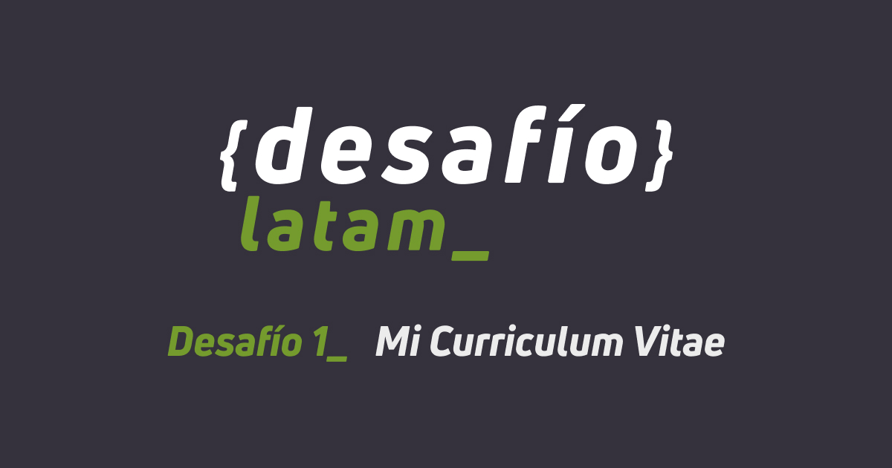

# Solución al Desafío 1 - Mi Curriculum Vitae en HTML

## Descripción

Construir un currículum vitae y un portafolio utilizando HTML.

## Requerimientos

- Estructura base del documento (etiquetas doctype, html, head, body).
- Títulos y párrafos.
- Listas (al menos una lista ordenada y una no ordenada).
- Imágenes.
- Enlaces (al menos uno, que dirija a la página del portafolio).
- Tablas (con títulos e imágenes de proyectos).
- Estructura correcta.

## Enlace en vivo

[Enlace en vivo](https://adl-mi-cv.netlify.app/)
